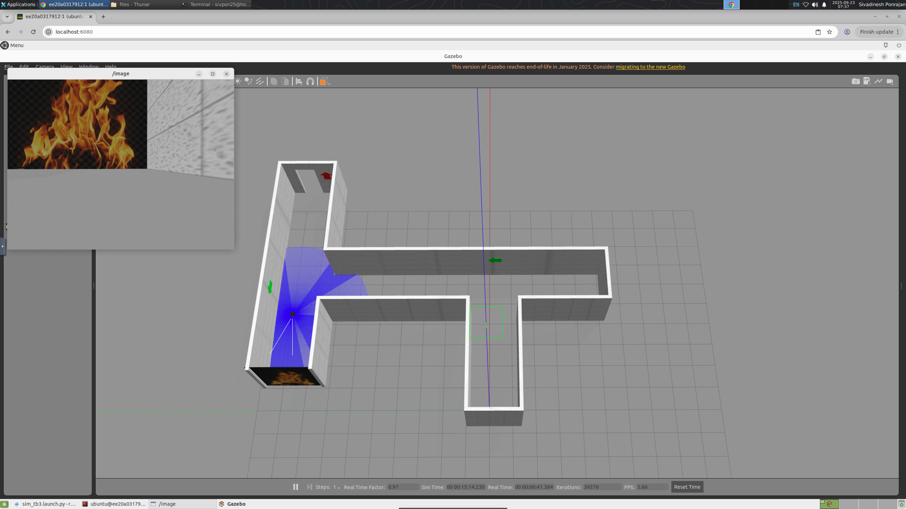
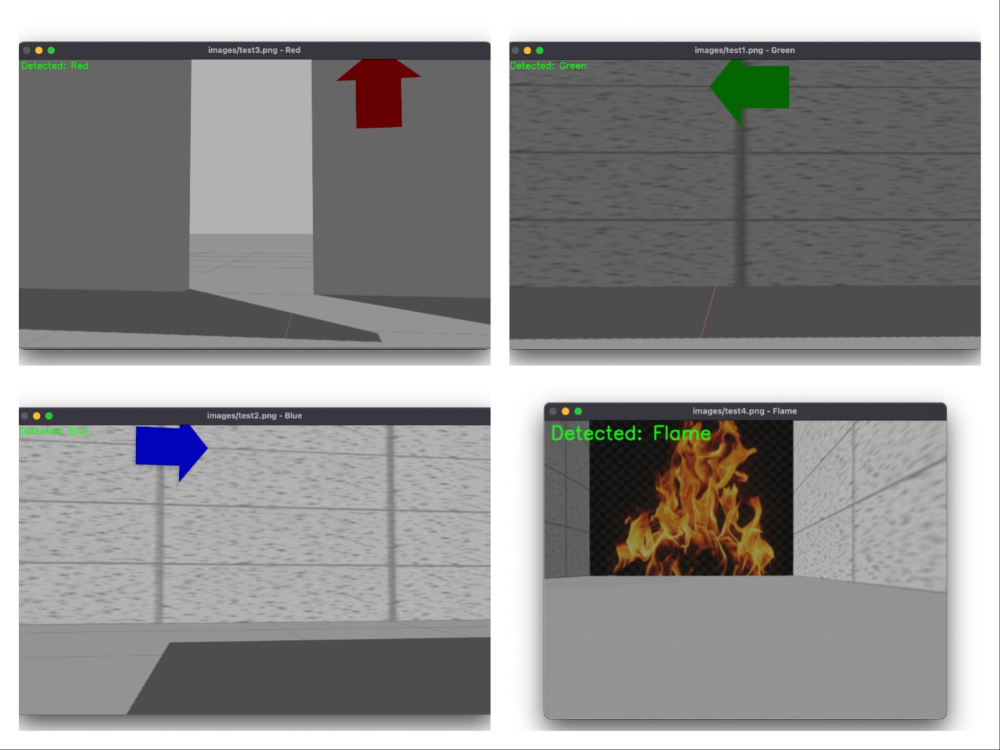

# PREVENT




---

## 🎯 What is this?

This is an intelligent robotics simulation that combines **computer vision** and **autonomous navigation** to detect fires and navigate through hazardous environments to the safer exit. Built on ROS2 and Gazebo simulation, it's designed for emergency response scenarios.

### 🌟 Key Features
- 🔍 **Color-based Arrow Detection** for navigation guidance
- 🔥 **Fire/Flame Detection** using computer vision
- 🤖 **Autonomous Robot Navigation** in simulated environments
- 🎮 **Real-time Control** via keyboard input
- 📷 **Live Camera Feed** from robot's perspective

---

## 🎨 Project Structure

```
PREVENT/
├── 🎯 Exercise/              # Computer vision workshop
│   ├── detect.py            # Arrow & color detection algorithms
│   ├── liveFlameDetection.py # Real-time flame detection
│   └── images/              # Test images for detection
├── 🤖 ros2_ws/              # ROS2 workspace
│   └── src/prevent/
│       ├── scripts/
│       │   ├── vision_detector.py  # Robot vision processing
│       │   └── bot_controller.py   # Navigation & movement
│       ├── launch/          # Simulation launch files
│       └── worlds/          # Gazebo world environments
└── 📚 docs/                 # Documentation & images
```

---

## 🧠 How It Works

### 1️⃣ **Vision Workshop** 
Start with the `Exercise/` folder to understand color detection:
- Learn arrow color detection (red, green, blue, orange)
- Practice with sample images
- Build your computer vision skills



### 2️⃣ **Robot Simulation**
Apply your skills in a realistic environment:
- Navigate a TurtleBot3 through a school simulation
- Use vision to detect navigation cues
- Make decisions based on what the robot "sees"

### 3️⃣ **Real World Implementation**
The same detection functions work in both:
- 🔬 **Workshop exercises** (`detect.py`)
- 🤖 **Robot simulation** (`vision_detector.py`)

---

## 🚀 Quick Start

### 📋 Prerequisites
- 🐧 Basic Python knowledge
- 💻 Computer vision fundamentals
- 🔧 OpenCV library

### 🎯 Start with the Workshop
```bash
# Install OpenCV for the exercises
pip install opencv-contrib-python

# Try the detection algorithms
cd Exercise/
python detect.py
```

### 🤖 Full Robot Simulation
Ready for the complete experience of the simulation? Follow our detailed setup guide:

**📖 [Complete Installation Guide →](INSTALLATION.md)**

*The installation guide includes Docker setup, ROS2 environment, and step-by-step instructions to get your robot simulation running!*

---

## 🎮 What You'll Experience

1. **🔍 Vision Detection**: Watch as your algorithms identify colored arrows and flames
2. **🌍 3D Simulation**: See your robot navigate through a realistic school environment  
3. **📷 Live Camera**: View the world through your robot's eyes
4. **🕹️ Interactive Control**: Drive your robot using WASD keys
5. **🧭 Autonomous Navigation**: Let the robot make decisions based on visual cues

---

## 🙏 Credits & Acknowledgments

Special thanks to **[@Tiryoh](https://github.com/Tiryoh)** for the amazing Docker ROS2 Desktop VNC environment that makes this simulation accessible through web browsers!

🔗 **Docker Environment**: [docker-ros2-desktop-vnc](https://github.com/Tiryoh/docker-ros2-desktop-vnc)

---
